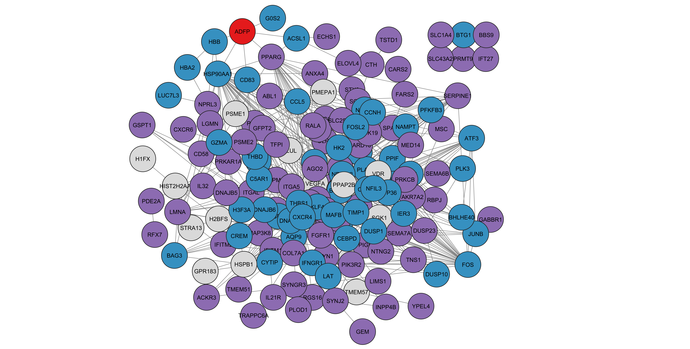

# comorbidity-network-analysis

Tuberculosis (TB) poses a serious threat to public health globally since it can affect anyone regardless of age or sex.
TB is still prevalent as one of the most infectious diseases and continues to cause disease burden and deaths across the world.

 <em>Nodes demarcated by colour: Red -> common proteins in between tuberculosis and HIV, green -> proteins involved in HIV and purple -> proteins involved in tuberculosis </em> 

In this study, comorbidity networks between TB and five other diseases: Diabetes, HIV, RA, COPD and Lung Cancer have been constructed. 
Major overlapping genes (OGs) were identified in the disease interactomes which allowed us to track the progression of the disease over time.

<ul> 
  <li> The datasets were processed individually by utilizing the various bioconductor packages in RStudio v4.2.0 namely limma, affy, dplyr, openxlsx.  </li>
  <li> The pre-processing of the microarray data consisted of principal component analysis (PCA), RNA degradation analysis and background adjustments using robust multiarray algorithm (RMA). </li>
  <li> The OGs found in the interactome of TB and its comorbidities were further functionally enriched using the DAVID Functional Enrichment Tool</li>
  <li> Diseases associated with TB due to the involvement of the aforementioned genes were also cross-verified using the DisGeNET (v7.0) Database. </li>
</ul>

